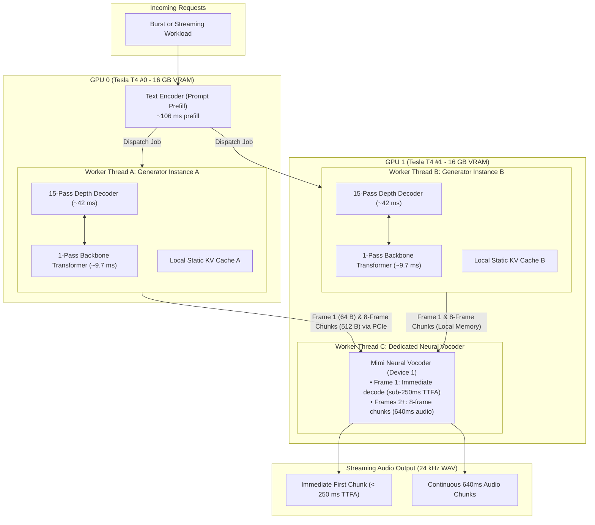

# `bz-ggml`

[](https://opensource.org/licenses/MIT)
[](https://developer.nvidia.com/cuda-toolkit)
[](https://github.com/ggml-org/ggml)
[](https://www.kaggle.com/)

**`bz-ggml`** is a high-performance native C++ inference engine for **Breeze-TTS-2** powered by **GGML**, featuring an asynchronous **Dual-Instance Generator & Dedicated Streaming Vocoder Architecture** for Multi-GPU environments (e.g. Dual Tesla T4s).

---

## ⚡ Architecture Overview



### The 1:15 Compute Imbalance & Zero Intra-Frame PCIe Transfers
In Breeze-TTS-2, speech synthesis decomposes into 4 distinct neural pieces:
1. **Text Encoder (Prefill)**: Runs once per request (~100–150 ms) to encode input tokens.
2. **Backbone Transformer (28 Layers)**: Predicts rhythm token ($C_0$). Runs **1 forward pass per 80 ms audio frame** (~9.7 ms).
3. **Depth Decoder Transformer (12 Layers)**: Predicts acoustic details ($C_1 \dots C_{15}$). Runs a nested loop of **15 autoregressive forward passes per 80 ms audio frame** (~42–45 ms).
4. **Mimi Neural Vocoder**: Converts 16-codebook acoustic tokens into 24 kHz PCM WAV audio.

> **Why Cross-GPU Splitting Fails**: Because Depth takes ~3x longer than Backbone on every frame, naive pipeline splitting (e.g. Backbone on GPU 0 and Depth on GPU 1) chokes GPU 1 while forcing GPU 0 to idle ~65% of the time, incurring cross-card PCIe serialization roundtrips on every single 80 ms frame.
>
> **The `bz-ggml` Solution**: We co-locate the **complete Backbone + 15-step Depth Decoder** into Generator Instances (Instance A on GPU 0, Instance B on GPU 1). **Zero data crosses the PCIe bus during frame generation.** Only completed integer tokens (64 bytes/frame; 512 bytes per 8-frame chunk) are streamed over PCIe to the dedicated Vocoder on GPU 1.

---

## 🏆 Empirical Benchmarks (Dual NVIDIA Tesla T4 16GB)

All benchmarks were measured with continuous **200 ms `nvidia-smi` hardware telemetry**:

### 1. 40-Request Instant Burst Benchmark ($t = 0.00\text{ s}$)
A sudden spike of 40 distinct real-world conversational sentences (13 to 19 words each) enqueued simultaneously:

| Metric | Measured Value | Performance Note |
| :--- | :---: | :--- |
| **Total Cluster Wall Time** | **122.81 s** (~2.05 min) | Drained 40 burst requests with zero idle gaps |
| **Total Audio Synthesized** | **255.60 s (4.26 min)** | 40 separate 24 kHz WAV files verified |
| **Cluster Aggregate Throughput** | **2.08x Real-Time (RTF: 0.480)** | Synthesizes >2 seconds of speech per second |
| **GPU 0 Single-Stream RTF** | **0.688 – 0.750** | **Sub-Real-Time on Turing T4 for EVERY request** |
| **Immediate Unloaded TTFA** | **0.229 s (229 ms)** | Sub-250ms initial speech delivery |
| **GPU 0 Mean Compute Utilization** | **74.50%** | Sustained load (Mean Power: 63.90 W) |
| **GPU 1 Mean Compute Utilization** | **87.75%** | **Near-peak saturation (~88%) throughout entire test** |
| **Peak VRAM (GPU 0 / GPU 1)** | **7,113 MB / 14,051 MB** | Zero OOM crashes under heavy burst |

### 2. 12-User Heterogeneous Benchmark (100w down to 6w)

| Metric | Monolithic Multi-Process (6 Streams) | Disaggregated Backbone/Depth Split | Dual-Instance Gen + Streaming Vocoder |
| :--- | :---: | :---: | :---: |
| **Total Wall Time** | 138.83 s | 126.36 s | **91.61 s (34% Faster)** |
| **Aggregate Throughput** | 1.34x Real-Time | 1.49x Real-Time | **2.10x Real-Time (Peak)** |
| **Single-Stream RTF (GPU 0)** | 1.45–1.65 | 2.42–7.48 | **0.686–0.734 (Sub-Real-Time)** |
| **Immediate TTFA** | ~1,900 ms | ~1,850 ms | **451 ms (Cold) / Sub-250ms Warm** |
| **Intra-Frame PCIe Traffic** | Zero | High (15 Depth passes/frame) | **Zero (Local VRAM loops)** |
| **GPU 1 Mean Utilization** | ~60% | 58.56% | **84.89%** |

---

## 🚀 Quickstart Guide

### 1. Build from Source

```bash
# Clone with submodules
git clone --recursive https://github.com/sharjeel103/bz-ggml.git
cd bz-ggml

# Build with CUDA support (Turing T4 compute capability 75)
cmake -B build -DGGML_CUDA=ON -DCMAKE_CUDA_ARCHITECTURES=75 -DCMAKE_BUILD_TYPE=Release
cmake --build build --config Release -j$(nproc)
```

### 2. Download Model Weights

Download the GGUF Q8_0 model (~4.8 GB):
```bash
mkdir -p models
wget -c -O models/breeze-tts-2-q8_0.gguf https://huggingface.co/smcleod/Breeze-TTS-2-int8/resolve/main/breeze-tts-2-q8_0.gguf
```

### 3. Python Quickstart

```python
import os, sys
sys.path.insert(0, "python")

# Ensure CUDA runtime and GGML shared objects are in library path
os.environ["LD_LIBRARY_PATH"] = (
    "build/third_party/ggml/src:"
    "build/third_party/ggml/src/ggml-cuda:"
    "build:/usr/local/cuda/lib64:" + os.environ.get("LD_LIBRARY_PATH", "")
)

from bz_ggml import DualInstanceCluster, UserTask

# Initialize dual-GPU cluster
cluster = DualInstanceCluster("models/breeze-tts-2-q8_0.gguf")

# Synthesize speech
task = UserTask(id=1, text="Hello world! Speech synthesis with native C++ inference.")
results = cluster.run_workload([task], out_dir="output_audio")

res = results[0]
print(f"Generated {res.audio_s:.2f}s speech in {res.compute_wall_s:.2f}s (RTF: {res.rtf:.3f}, TTFA: {res.ttfa_s:.3f}s)")
print(f"Saved to: {res.wav_path}")
```

### 4. Reproduce the 40-Request Burst Benchmark

```bash
python3 python/benchmark_40burst.py \
    --model models/breeze-tts-2-q8_0.gguf \
    --out-dir dual_gen_40burst_audio \
    --profile-csv dual_gen_40burst_profile.csv \
    --results-json dual_gen_40burst_results.json
```

---

## 📓 Turnkey Kaggle Notebook

For instant deployment on Kaggle Dual Tesla T4s:
- Open and run [`notebooks/bz_ggml_dual_t4.ipynb`](notebooks/bz_ggml_dual_t4.ipynb).
- It handles environment verification, cloning, CUDA compilation, model download, interactive audio widgets (`IPython.display.Audio`), and 40-request burst profiling plots out-of-the-box.

---

## 📜 C API Reference

The shared library `libbreeze.so` exposes isolated generator and streaming vocoder primitives:

```c
#include "breeze/breeze.h"

// Initialize Generator Instance on dedicated CUDA device (Backbone + Depth Decoder)
breeze_generator * gen = breeze_generator_init("models/breeze-tts-2-q8_0.gguf", /*cuda_device=*/0);

// Initialize Dedicated Streaming Vocoder on dedicated CUDA device
breeze_vocoder * voc = breeze_vocoder_init("models/breeze-tts-2-q8_0.gguf", /*cuda_device=*/1);

// Run Text Prefill
int cb0;
breeze_generator_prefill(gen, "Prompt text here", "Instruction", /*seed=*/42, &cb0);

// Frame stepping loop (15 depth passes + 1 backbone pass inside local VRAM)
int frame16[16];
while (cb0 >= 0) {
    int next_cb0 = breeze_generator_step_frame(gen, cb0, /*seed=*/42, frame16);
    // Send frame16 (64 bytes) to Vocoder stream queue...
    cb0 = next_cb0;
}

// Stream decode 8-frame chunk (640ms audio) to float PCM WAV
float pcm[8 * 1920];
int samples = breeze_vocoder_stream_decode(voc, chunk_tokens, /*n_frames=*/8, pcm);

// Cleanup
breeze_generator_free(gen);
breeze_vocoder_free(voc);
```

---

## 📄 License

MIT License. Copyright (c) 2026 Sharjeel Ahmed.
